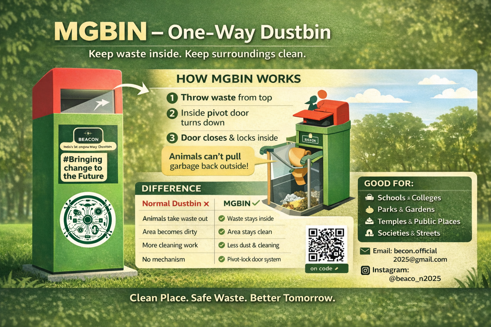

# MGBin – Monkey Guard Smart Dustbin

**MGBin (Monkey Guard Bin)** is a smart, hybrid automation dustbin designed to prevent monkeys and other wildlife from accessing and scattering waste in urban, tourist and residential areas.  
It combines **IoT-based intelligence with mechanical fail-safe automation**, making it reliable, scalable and suitable for Smart City deployments.

## 🎥 Prototype Video Documentary

📽 Watch full working prototype demonstration here:  
👉 ****

This documentary demonstrates:
- Mechanical pivot-door working
- Automatic flap motor control
- Mechanical gravity-based fail-safe mode
- Real-life testing scenarios

---

## 🚨 Problem Statement

In many Indian cities, monkeys and other wildlife frequently open traditional dustbins, scattering garbage across streets, parks and public places.  
This causes:

- Poor sanitation and unhygienic environments  
- Spread of diseases  
- Continuous cleaning costs  
- Human–animal conflict in residential and tourist zones  

Conventional bins provide **no protection against animal tampering**.

---

## 💡 Proposed Solution

MGBin introduces a **hybrid automation system** that allows only humans to deposit waste while completely blocking animals from accessing it.

The system works in **two intelligent modes**:

### 1️⃣ Smart IoT Mode (Primary)
- An **ESP32-CAM** detects whether the approaching object is a **human or an animal (monkey)**.
- For humans → the flap **opens automatically** using a **gear motor**.
- For animals → the flap **remains locked**, preventing access.

### 2️⃣ Mechanical Gravity Mode (Fail-Safe)
- If sensors, power, or electronics are unavailable, the bin continues to function mechanically.
- A **pivoted gravity-balanced internal door** allows humans to deposit waste but stays locked against animal interference.

This ensures **100% operational reliability** even during power failure or remote deployments.

---

## ⚙️ Key Features

- Dual-mode hybrid automation (IoT + Mechanical)  
- ESP32-CAM based animal/human detection  
- Automatic flap control using gear motor  
- Gravity-based fail-safe mechanical design  
- Weather-resistant and tamper-proof build  
- Low maintenance and long operational life  
- Cost-effective and scalable manufacturing  

---

## 🔁 How It Works

    1. A person approaches the bin  
    2. ESP32-CAM analyzes object type  
    3. If human → motor opens flap  
    4. Waste is deposited  
    5. Flap auto-locks again  
    6. If animal detected → flap remains locked  
    7. In power failure → gravity mechanism allows human-only disposal  

---

## 🧠 Automation Logic

| Detection | Action | Result |
|---------|------|------|
| Human detected | Motor opens flap | Trash accepted |
| Animal detected | Flap locked | Access denied |
| No power | Mechanical pivot door works | Manual human access |

---

---

## ⚙️ Mechanical Flow Diagram
```text
+--------------------------+
|     Human Approaches     |
+--------------------------+
              |
              v
+--------------------------+
|   Waste Dropped from     |
|         Top Slot         |
+--------------------------+
              |
              v
+--------------------------+
|   Pivoted Internal Door  |
|   Receives Waste Load   |
+--------------------------+
              |
              v
+--------------------------+
| Door Rotates Downward    |
| (Gravity Controlled)    |
+--------------------------+
              |
              v
+--------------------------+
| Waste Falls into Main    |
| Collection Chamber      |
+--------------------------+
              |
              v
+--------------------------+
| Door Returns to Locked  |
| Position Automatically  |
+--------------------------+
              |
              v
+--------------------------+
| Animals Blocked from    |
| Accessing Garbage       |
+--------------------------+
```
---

---

## 🔒 Animal Blocking Logic
```text
Animal tries to access → Door remains locked → No leverage / no grip → Access denied → Garbage stays inside
```
---
## 🛠 Technologies & Components

- ESP32-CAM  
- Gear Motor  
- Mechanical Pivot Door  
- Gravity Balanced Design  
- Structural Metal / Polymer Body  
- Smart Automation without Dependence on Electricity  

---

## 🌍 Impact

- Improves public hygiene and sanitation  
- Prevents garbage scattering  
- Reduces human–wildlife conflict  
- Saves municipal cleaning costs  
- Enables Smart City and Swachh Bharat initiatives  

---

## 🚀 Future Scope (Round-2 Enhancements)

- AI-based waste detection using ESP32-CAM for improved human vs animal recognition  
- Smart waste segregation using multi-sensor detection (metal, moisture, liquid, IR, camera)  
- Automatic internal motorized flaps to separate wet, dry, plastic, metal and liquid waste  
- Organic waste composting & fertilizer conversion module  
- Ultrasonic fill-level detection with cloud dashboard monitoring  
- Solar panel & rechargeable battery power backup  
- LED indicators and auto-lid for hygienic public usage  
- Centralized IoT analytics dashboard for municipal monitoring  
- Incentive system to promote responsible waste disposal  


---

## 👥 Team

| Name | Role |
|-----|-----|
| Mayank Gangawar | Project Lead & Designer |
| Manthan Makhija | Coder |
| Sachin Shakya | Circuit Designer |
| Shobit Rajpoot |  Mechanical Design Engineer |


---

## Video Overview
https://youtu.be/zOyi-Keoz-M
